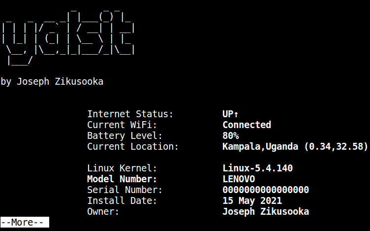

](https://twitter.com/jzikusooka)
")

Introduction
------------

Here's Yet Another Linux System Information Tool (YALSIT) I wrote for
our Linux based Jambula smart home hub systems. 

Use it on any Linux system to generate system information such as: System Model/Serial Number, Kernel Software Version, Hardware (CPU, GPU, Memory, Disks), Networking information, Current WiFi/Internet status, GeoLocation, etc.

For updates to this, and other CLI tools, please follow me on twitter: **[@jzikusooka](@jzikusooka)** or email me at *josephzik AT gmail.com*

Your contributions are welcome.  For bug fixes, please open an issue

Supported Platforms
-------------------
- Linux
- FreeBSD? (Not yet tested)

Requirements
------------
* systemd 
* dmidecode

* Available on most major Linux distributions

Usage
------
Please run as root:

sudo ./yalsit
